Vue、React 的项目怎么调试我们都知道了，这节我们来调试下 React 的源码。

把 react 和 react-dom 包下载了下来，在项目里引入，开发服务跑起来后，打开 Chrome Devtools 打断点调试。

你会发现调试的是 react-dom.development.js


这是因为 react-dom 包下就是编译后的 react-dom.development.js 文件：

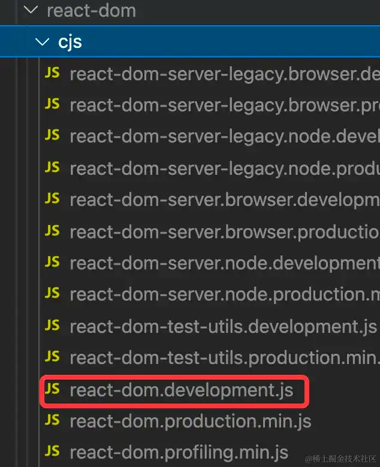

而源码里这些逻辑是分散在不同的包里的，所以就算搞懂了逻辑，也不知道这些逻辑在哪些包里，只能靠搜索来定位。

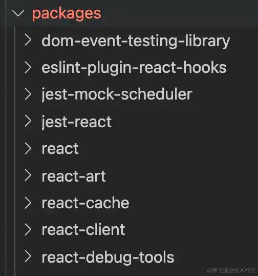

那怎么能够调试 React 最初的源码呢？

也就是这样的效果：

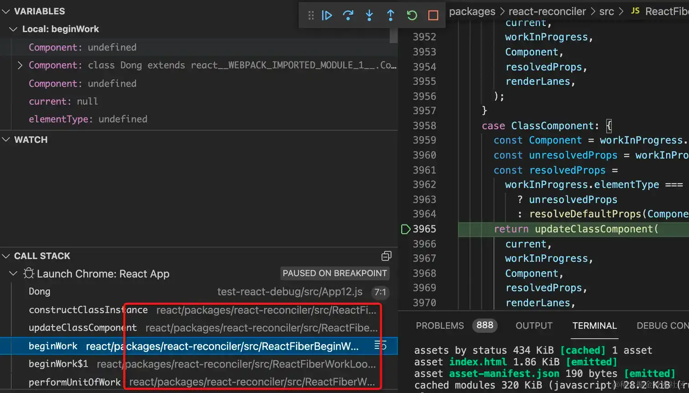


这就需要用到我们刚学的 sourcemap 的知识了：

## 用 VSCode 调试 React 项目

我们用 create-react-app 创建一个 react 项目，然后 npm run start 跑起来。

这时候浏览器访问就可以用 Chrome DevTools 调试了：

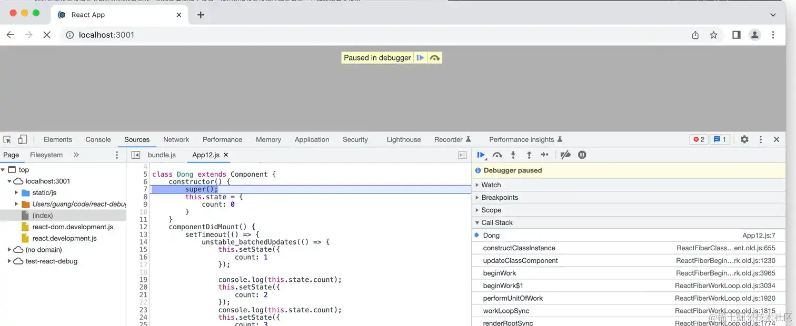

但我们的目标是在 VSCode 里调试，所以要添加一个 VSCode 的 debugger 配置：


然后点击 debug 启动：


这时候就可以在 VSCode 里直接打断点调试了：

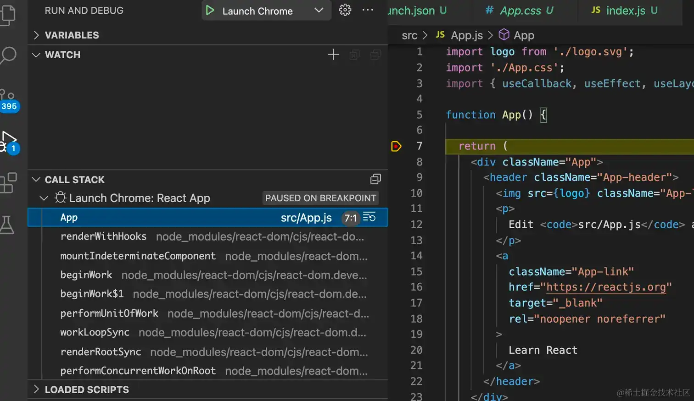

用 VSCode 调试比 Chrome DevTools 方便一些，但现在调试的依然是 react-dom.development.js：


那怎么调试 react 最初的源码呢？

这就涉及到 sourcemap 的作用了。但是现在下载的 react、react-dom 包里都不带 sourcemap，我们得把 React 源码下载下来自己 build：

## build 出带有 sourcemap 的 react 包

用 npm 下载的 react 包是这样的：

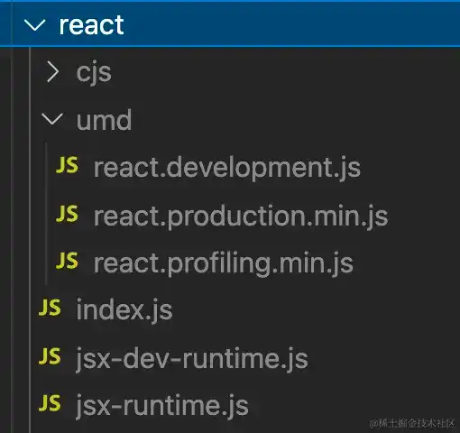

而我们需要的是带有 sourcemap 的代码，也就是这样的：

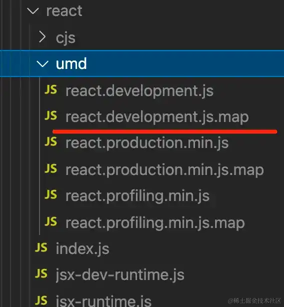

这就要下载 react 源码自己 build 了：

```bash
bash

复制代码git clone https://github.com/facebook/react
```

下载之后 reset 到这个 commit：

```css
css

复制代码git reset --hard 80f3d88190c07c2da11b5cac58a44c3b90fbc296
```

我当时调试的时候 react 是 18.2，用的上面这个 commit。不确定后续会不会有构建脚本的变化，为了保证一定能正常生成 sourcemap，建议 reset 到和我同一个 commit。

下载下来的代码执行 npm run build 就能看到 build 的产物（先不用跑这一步）：

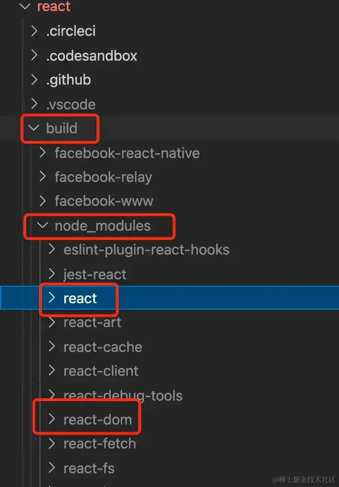

这里的 build/node_modules 下的 react 和 react-dom 包就是我们需要的。

但是现在 build 出的代码并没有带 sourcemap，需要改造下 build 流程。


build 命令执行的是 ./scripts/rollup/build.js，打开这个文件做一些修改。

找到 rollup 的配置，添加一行 sourcemap: true，这个很容易理解，就是让 rollup 在构建时产生 sourcemap：

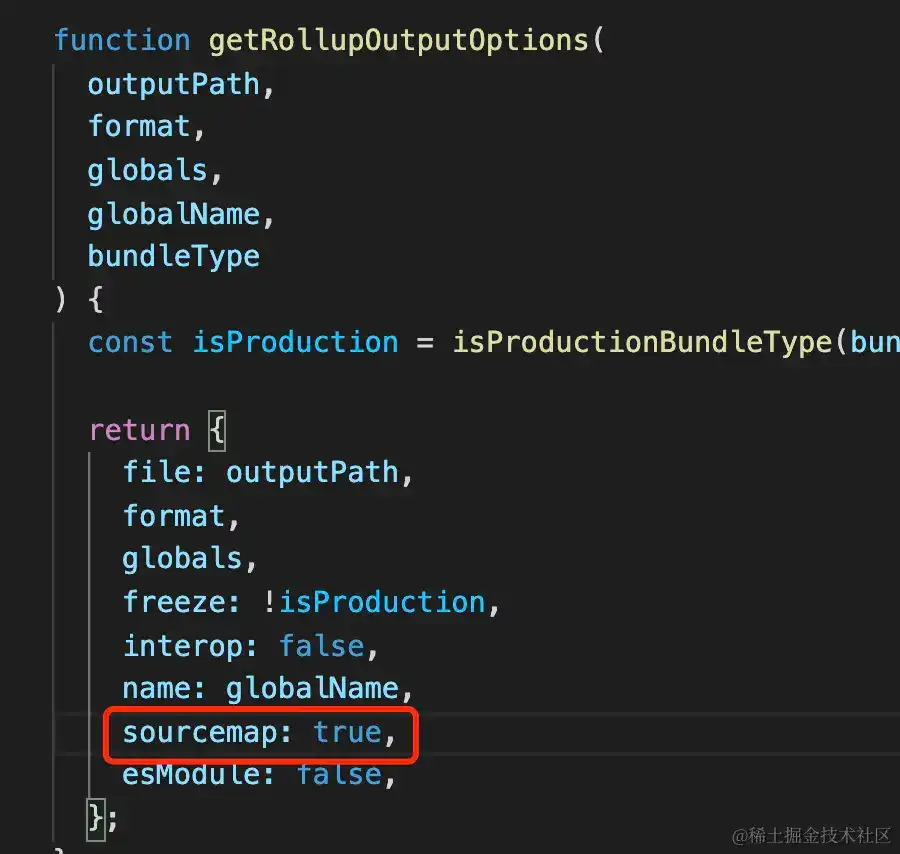

再跑 npm run build，会报这样的错误：


某个转换的插件没有生成 sourcemap。

这个是因为构建的过程中会进行多次转换，会生成多次 sourcemap，然后把 sourcemap 串联起来就是最终的 sourcemap。如果中间有一步转换没有生成 sourcemap，那就断掉了，也就没法把 sourcemap 串联起来了。

这个问题的解决只要找出没有生成 sourcemap 的那几个插件注释掉就可以了：

在 getPlugins 方法里，把这样 5 个插件给注释掉：


这个是删除 use strict 用的，可以去掉。


这个是生产环境压缩代码的，也可以去掉。

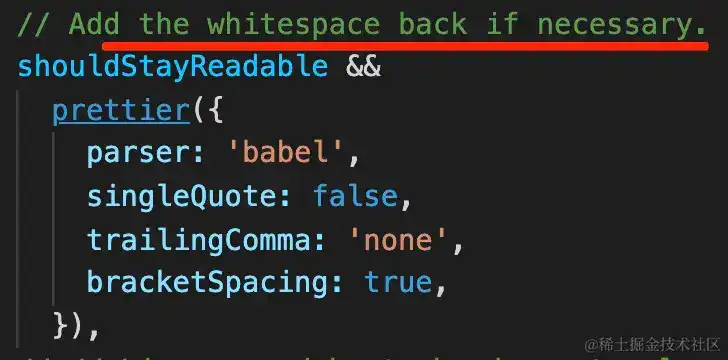

这个是用 prettier 格式化代码的，也可以去掉。


这个是添加一些头部的代码的，比如 Lisence 等，也没啥用，可以去掉。

还有这个：


去掉这 5 个插件之后，再运行 npm run build，这时候就能正常进行构建了，然后产生的代码就是带有 sourcemap 的：

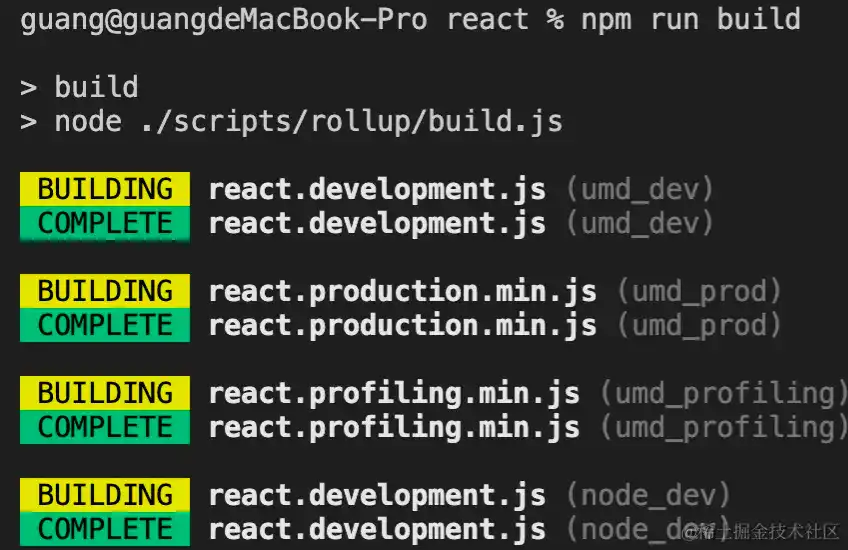

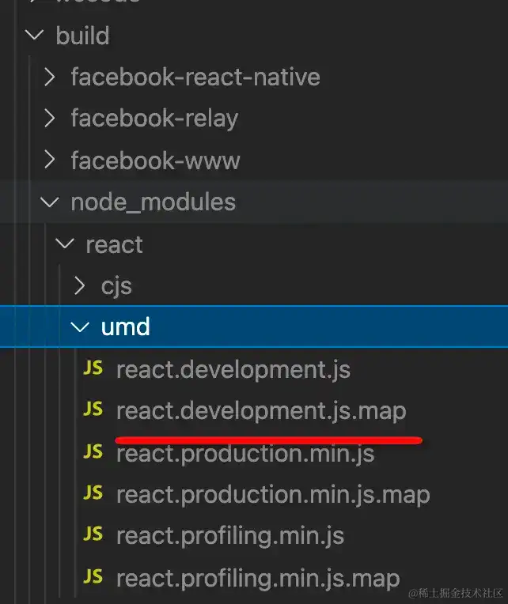

这样我们就成功的 build 出了带有 sourcemap 的 react 包！

接下来只剩最后一步，用上 sourcemap，实现直接调试 React 最初的源码，

## 应用 sourcemap，调试 React 最初的源码

我们已经 build 除了带有 sourcemap 的 react 和 react-dom 包，那把这俩包复制到测试项目的 node_modules 下，就可以直接调试最初的源码了么？

还是不行。

为什么呢？


因为我们虽然 build React 源码生成了 sourcemap，但是 webpack 打包的时候没有关联它啊，这样 webpack 的 sourcemap 就只能映射到 react-dom.development.js 不能进一步映射到源码了。

那怎么办呢？

这个问题有两种解决方式：

很容易想到的就是改下 sourcemap 的配置，这个我们上节刚学过，加上 module 的配置就能读取和关联 loader 的 sourcemap，然后一层层关联到源码了。

但是用 create-react-app 创建的项目，webpack 配置改起来比较麻烦，这种方式放后面讲。

还有一种方式就是不打包 react 和 react-dom 这俩包。用 script 标签单独引入，这样浏览器就会解析这俩文件各自的 sourcemap，进而映射到源码。

那怎么不打包这俩模块呢？

webpack 支持 externals 来配置一些模块使用全局变量而不进行打包，这样我们就可以单独加载 react、react-dom，然后把他们导出的全局变量配置到 externals 就行了。

要改动 webpack 配置的话，在 create-react-app 创建的项目下要执行 npm run eject。

然后项目下会多出 config 目录和 public 目录，这俩分别放着 webpack 配置和一些公共文件。

修改 webpack 配置，在 externals 下添加 react 和 react-dom 包对应的全局变量：


然后把 react.development.js 和 react-dom.development.js 放到 public 下，并在 index.html 里面加载这俩文件：


这样再重新 debug，你就会发现 sourcemap 映射到 React 最初的源码了：


不再是 react-dom.development.js 下的代码，而是具体 react-xxx 包下的。

这就达到了最开始的目的，能直接调试 React 最初的源码！


还记得我们这样做的意义么？

能调试最初的源码才能知道哪段逻辑是在哪个包里的，不然要自己去搜索。

这样已经能够达到我们的目的了，但是要想点击调用栈直接定位到 git clone 下来的 react 项目的文件，还需要再做一步。

## 关联 react 源码项目

看我最初演示的效果，点击调用栈是能直接定位到 react 源码项目的文件的：


这是怎么做到的呢？

其实只要 sourcemap 生效，并且 map 到的文件是在当前 workspace 下，VSCode 就会打开对应的文件。

现在 sourcemap 已经生效了，只不过 react 项目没有在 workspace 下。所以，如果想直接定位 react 源码项目的话，可以这样做：

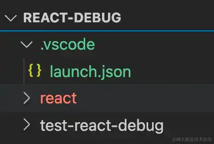

创建一个新的目录，把 react 源码项目和测试的项目放到一个 workspace 下，这样再调试的时候，map 到的文件就能在 workspace 找到了，也就会打开相应的文件。

只不过现在 sourcemap 下都是这样的相对路径，会导致映射到的文件路径不对：


所以再去修改下 react build 流程，在 ./script/rollup/build.js 下，添加一个 sourcemap 的路径映射，把 ../../../packages 映射到 react 项目的绝对路径/packages ：


这时候再重新 build，生成的 sourcemap 就是绝对路径了：

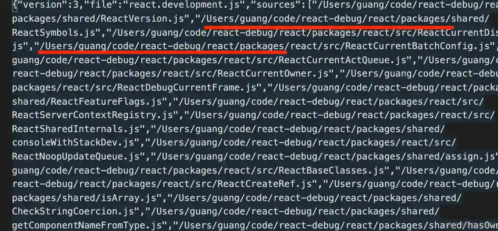

把 build 出的带有 sourcemap 的代码复制到项目的 node_modules 下，覆盖一下。这四个文件 react.development.js、react.development.js.map、react-dom.development.js、react-dom.development.js.map

在新的 workspace 里 debug，你就会发现，路径映射对了：


点击调用栈能直接打开 react 源码项目的对应文件了！


因为只要 sourcemap 映射到的文件在 workspace 下能找到，VSCode 就会把它打开并定位到对应行列号。

**更重要的是，现在就可以直接在 react 的 src 下打断点了，代码执行到那里就会断住，这是把 react 源码也放到 workspace 下的最大的好处。**

至此，我们就能优雅的调试 React 最初的源码了。

## 让 webpack 的 sourcemap 映射回 React 源码

前面我们通过 external 的方式走通了调试 React 源码的流程，这样是可以的，就是不算很优雅。

我们回过头来再来看一下，怎么能让 webpack 生成的 sourcemap 能一次性映射回 React 源码呢？

记得上节讲 webpack 配置的时候，讲到了 module 相关的配置么？


module 配置的作用就是让 webpack 在生成模块的 sourcemap 的时候，读取下每个 loader 的 sourcemap，关联起来。

但是只有这样还不够，我们现在是 react 和 react-dom 包的代码本身有了 sourcemap，而且这些代码也不用经过 babel 的编译，所以还需要一个 source-map-loader 来把这些 sourcemap 读取出来，传递给后续的 loader：


这样，webpack 的 sourcemap 就是直接映射到 React 源码的了。

我们不在 create-react-app 创建的项目里改，而是自己创建一个项目。

添加这样一个 webpack 配置文件：

```javascript
javascript复制代码const path = require('path');

module.exports = {
    entry: './src/index.js',
    devtool: 'cheap-module-source-map',
    mode: 'development',
    output: {
        path: path.resolve(__dirname, 'dist'),
        filename: 'bundle.js',
    },
    module: {
        rules: [
            {
                test: /node_modules/,
                loader: 'source-map-loader'
            },
            {
                test:/\.jsx?$/,
                include: path.resolve(__dirname,'./src'),
                loader:'babel-loader'
            }
        ]
    }
};
```

devtool 配置加上 module，这样会关联 loader 的 sourcemap。

source-map-loader 用来读取 node_modules 下代码的 sourcemap 传递给 webpack 的。

babel loader 是用来编译 jsx 代码的，添加这样一个 .babelrc 的配置文件：

```javascript
javascript复制代码module.exports = {
    presets:['@babel/preset-react']
}
```

源码是这样：

```javascript
javascript复制代码import React from 'react';
import ReactDOM from 'react-dom/client';

function Aaa() {
    debugger;
    return <div>dongdongdong</div>
}

const container = document.getElementById('root');

const root = ReactDOM.createRoot(container);
root.render(React.createElement(Aaa));
```

在 html 里引入产物 bundle：

```html
<!DOCTYPE html>
<html lang="en">
<head>
    <meta charset="UTF-8">
</head>
<body>
    <div id="root"></div>
    <script src="./dist/bundle.js"></script>
</body>
</html>
```

执行 webpack -c webpack.config.js 编译。

然后添加一个调试配置：

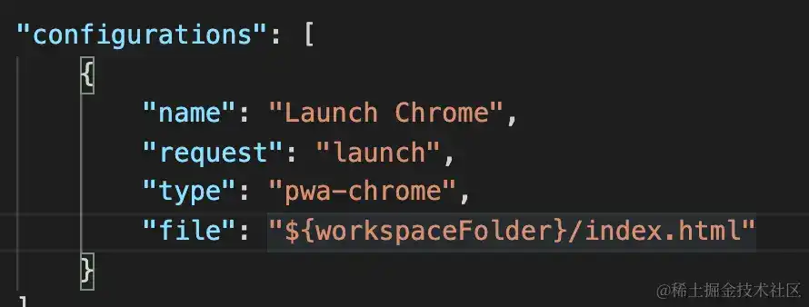

把生成的 react、react-dom 的产物复制到 node_modules 下：

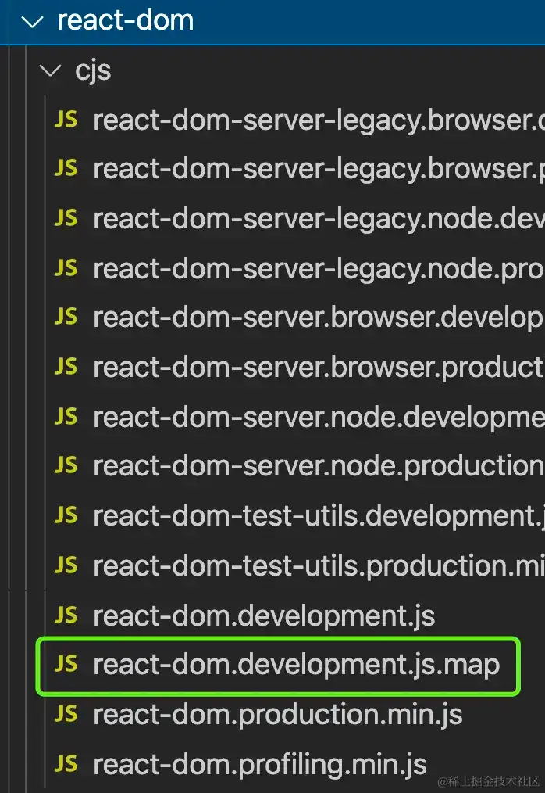

点击 Debug 启动：

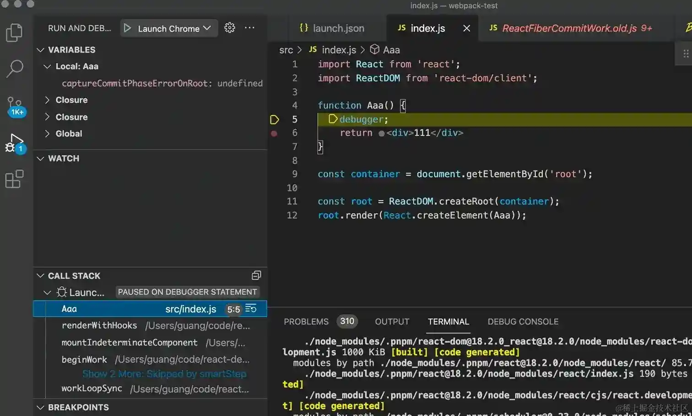

这时候调用栈中的就是 React 的源码。

只不过因为现在 workspace 中没有对应的文件，可以用同样的方式把 react 源码项目和 demo 项目放到一个 workspace，然后再调试：


这样就能调试 React 源码，并且直接在编辑器里打开对应的文件了。

这样直接修改了 node_modules 下的文件感觉不太好，下次安装就没了。

这个问题可以用 patch-package 解决：

执行 npx patch-package react-dom，就会生成这样的目录：


patches 目录下的就是每个包的 diff，在哪个文件添加了删除了什么代码。

执行 npm install 之后，执行一下 npx patch-packages 就会应用这些 patch 来修改 node_modules 下的包。

不过 patch-package 不支持 pnpm，所以只有你用 yarn 或 npm 安装的依赖才能用 patch-package。

## 总结

调试了下 React 源码，常规的调试方式只能调试 react-dom.development.js，虽然能理清逻辑，但是对应不到源码里的哪些包哪些文件，和最初的源码还有一段距离。

这个问题是有解决方案的，就是通过 sourcemap：

首先要把 react 源码项目下载下来，修改 build 流程来生成带有 sourcemap 的 react 和 react-dom 包，并且修改 sourcemap 映射的路径为绝对路径。

然后把 react 和 react-dom 配置到 webpack 的 externals 里，不进行打包，而是单独在 index.html 里引入。

这样调试的时候这俩模块的 sourcemap 就可以生效，直接映射回 React 源码。

当然，也可以自己建一个 React 项目，配置 webpack 的 devtool 为 module 相关的，这样会读取 loader 的 sourcemap，然后加上 source-map-loader 来读取源码的 sourcemap。

这样生成的 webpack 的 sourcemap 是直接可以映射到 React 源码的。

如果想点击调用栈直接打开对应 React 源码项目的文件，那就新建一个 workspace，把测试项目和 React 源码项目包含就行了。因为 VSCode 如果在 workspace 下找到了 source map 到的文件，就会直接打开对应的文件。这样就可以直接在源码打断点了。

这个流程是有点复杂，但其实都是围绕 sourcemap 来的，怎么生成 sourcemap，怎么让 sourcemap 生效，怎么找到 sourcemap 对应的文件等，理解了 sourcemap，也就很容易理解这个流程了。
