VSCode Debugger 调试的时候需要创建调试配置，默认生成的配置往往不是符合需求的，需要做一些修改。

比如调试 Vue 项目时，默认生成的调试配置是这样的：

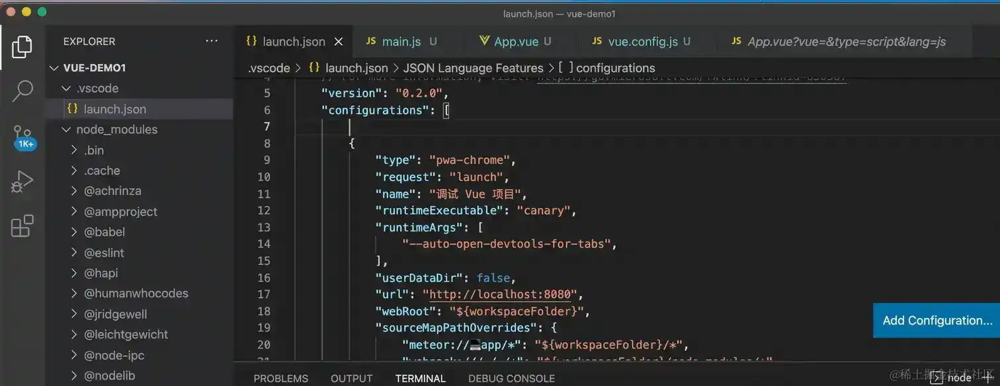

而我们最终用的是这样：

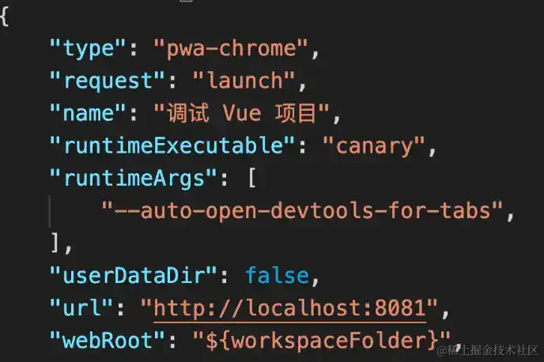

那能不能像生成默认配置一样，快速生成我们需要的调试配置呢？

可以的，这需要用到 VSCode 的 Snippets 功能。

Snippets 是代码片段的意思，输入前缀就可以快速填入代码片段。


我们如何自己写一个 Snipppets 呢？

按住 cmd + shift + p 调出 VSCode 命令面板，输入 snippets，选择 Configure User Snippets：


创建一个项目级别的 Snippets：


在 .vscode 下就会多出一个 xx.code-snippets 的文件：

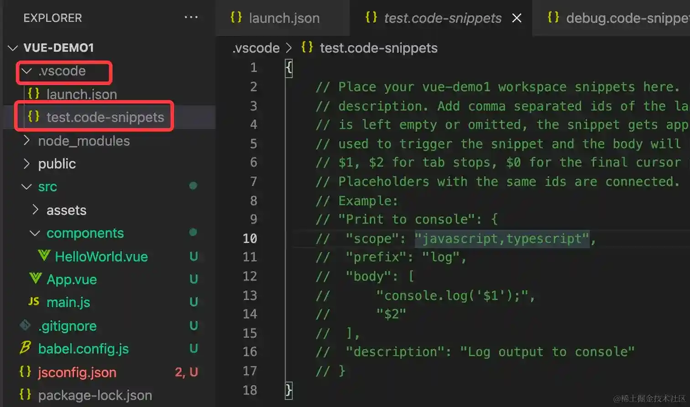

注释的部分就是 demo 配置，我们把它打开：


- prefix 就是这个 snippets 生效的前缀
- body 是插入的内容
- description 是描述
- scope 是指定 snippets 生效的语言

这个 snippets 的作用就是在这个项目目录下的 js、ts 文件里，输入 log 的时候会提示，选中之后就会插入 body 部分的内容。

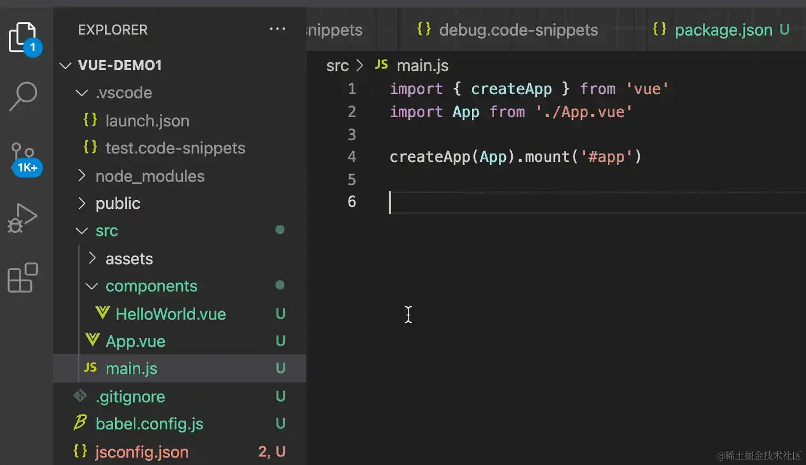

body 部分是待插入的代码，支持很多语法，也是一种 DSL（领域特定语言）。

支持通过 $1、$2 指定光标位置：

```bash
bash复制代码"$1  xxxx",
"yyyy $2"
```


可以多光标同时编辑：

```bash
bash

复制代码"$1  xxxx $1"
```

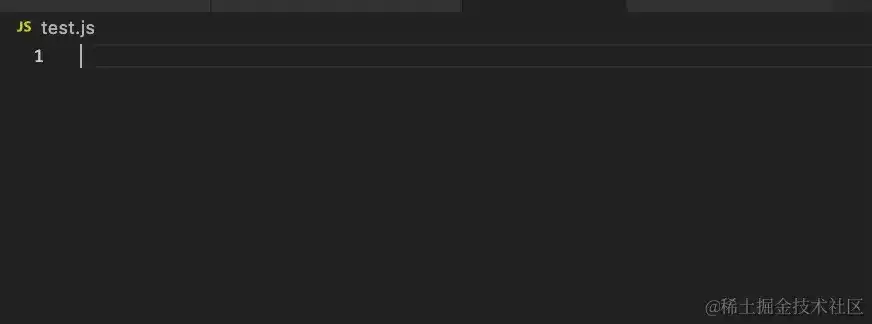

可以加上 placeholader，也可以做默认值：

```bash
bash复制代码"${1:aaa}  xxxx",
"yyyy ${2:bbb}"
```

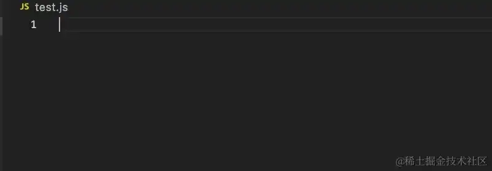

可以提供多个值来选择：

```bash
bash

复制代码"你好${1|光光,东东|}"
```

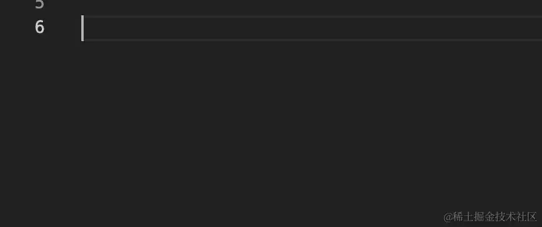

还提供了一些变量可以取：

```bash
bash复制代码"当前文件： $TM_FILENAME",
"当前日期： $CURRENT_YEAR/$CURRENT_MONTH/$CURRENT_DATE"
```


所有可用变量可以在 [VSCode 文档](https://link.juejin.cn/?target=https%3A%2F%2Fcode.visualstudio.com%2Fdocs%2Feditor%2Fuserdefinedsnippets%23_variables)里看到。

而且还能对变量做正则替换：

```bash
bash

复制代码"${TM_FILENAME/(.*)\\.[a-z]+/${1:/upcase}/i}"
```


一共就这些语法：

指定光标位置：$x
多光标编辑：$x $x
指定 placeholder 文本：${x:placeholder}
指定多选值：${x|aaa,bbb|}
取变量：$VariableName
对变量做转换：${VariableName/正则/替换的文本/}

综合运用这些语法，就可以实现很多方便的 Snippets。

比如 React、Vue 的调试配置就可以封装成 Snippets：

React 项目的调试配置可能是这样的：

```json
{
    "type": "pwa-chrome",
    "request": "launch",
    "name": "调试 React 项目",
    "runtimeExecutable": "canary",
    "runtimeArgs": [
        "--auto-open-devtools-for-tabs",
    ],
    "userDataDir": false,
    "url": "http://localhost:8080",
    "webRoot": "${workspaceFolder}"
}
```

我们把它做成 snippets 需要把这段内容变为字符串拼接的方式放在 body 里，这个还是挺麻烦的。

不过有[工具网站 snippet-generator.app ](https://link.juejin.cn/?target=https%3A%2F%2Fsnippet-generator.app%2F)来做这件事情，只需要把内容贴在左边，那么在右边就会展示变为 snippets 之后的配置。


把它复制出来然后再做一些修改：

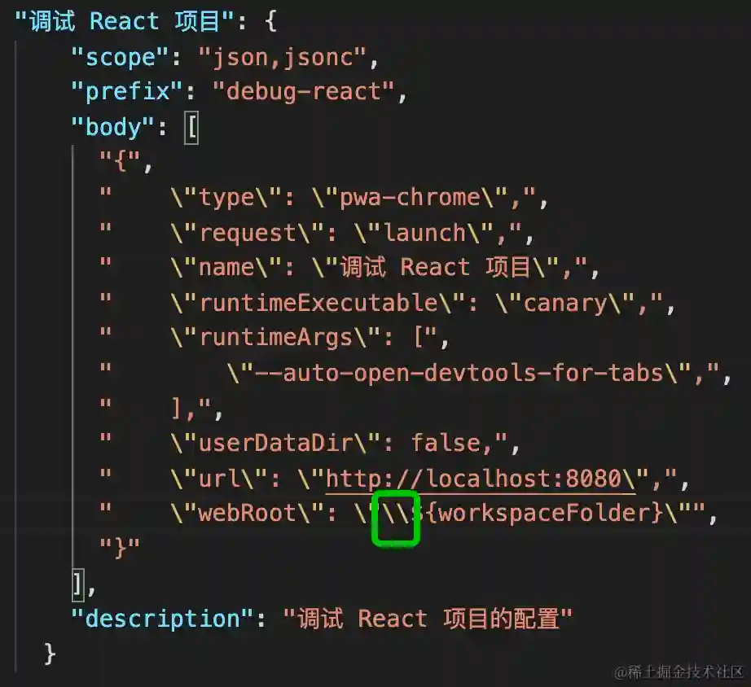

注意 ${workspaceFolder} 这部分和 snippets 的语法有冲突，所以需要加上个 \ 来转义。

scope 指定为 json 和 jsonc，这是因为 json 文件对应两种语言：

jsonc 是 json with comments，带注释的 json，因为 json 语法是不支持注释的，而我们又想在 json 文件里加一些注释，所以平时都是用 jsonc 的类型。

点击右下角的语言部分：


可以切换文件的语言：


会发现 json 文件对应两种语言，所以这里 scope 都要填上。

这样创建 React 调试配置的时候就方便了。

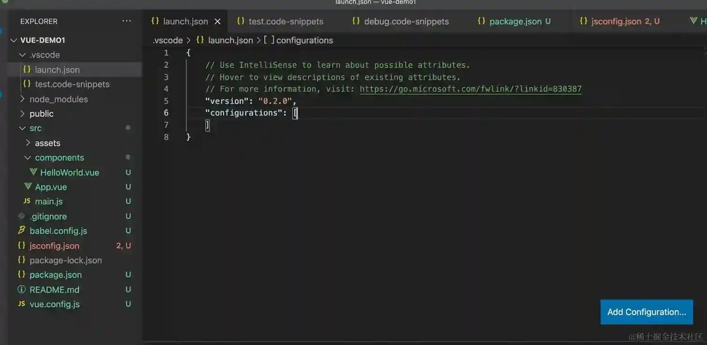

上面的 snippets 还可以进一步优化，比如端口的部分可以指定光标输入，默认是 8080：

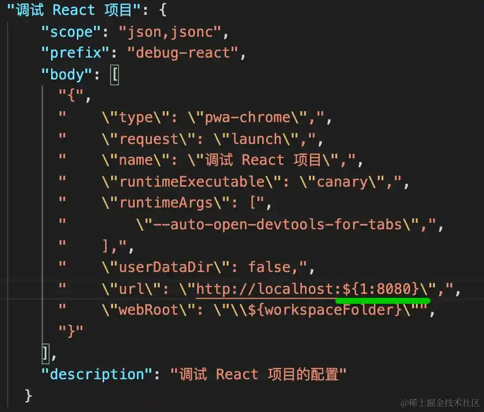

这样在创建调试配置的时候能顺便把端口也改了：

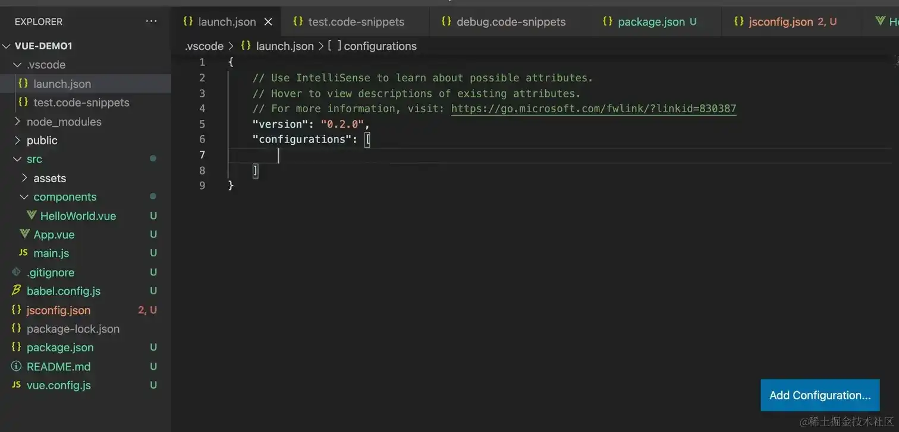

当然，前面提到的 snippets 的语法都可以用起来，封装适合自己的创建调试配置的 snippets。

现在还有一个问题，我们创建的 snippets 是保存在 .vscode 目录下的，只有当前项目生效，怎么能让别的项目也能用呢？

其实 snippets 一共三种范围：


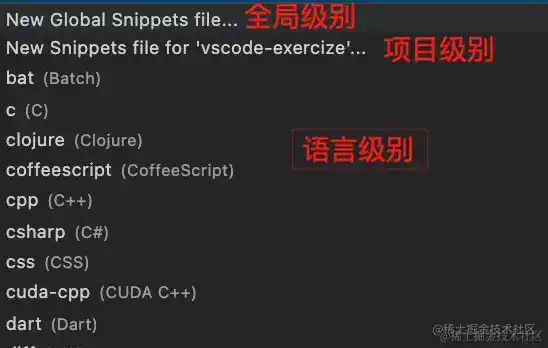

全局级别是全局生效的，项目级别只在当前项目生效，语言级别是某种语言的文件里生效。

把这段创建调试配置的 snippets 放到全局 snippets，那样就每个项目都能用了。

## 总结

为了快速创建符合需求的调试配置，我们可以把它们封装成 snippets。

snippets 是根据前缀快速填入一段代码片段的。

有这些语法：

指定光标位置：$x
多光标编辑：$x $x
指定 placeholder 文本：${x:placeholder}
指定多选值：${x|aaa,bbb|}
取变量：$VariableName
对变量做转换：${VariableName/正则/替换的文本/}

snippets 有项目、语言、全局三种生效范围，调试配置一般是要做成全局的 snippets。

我们可以把符合需求的调试配置封装成 snippets，这样之后再创建调试配置就方便多了。