知道了如何调试 React 源码，这节我们再来调试下 Vue 源码。

首先，还是通过 vue cli 创建项目（要用 5.0 以上的 cli）：

安装 @vue/cli 后执行 vue create vue-demo 创建 vue 项目：

```lua

vue create vue-demo
```


选择 vue3 的模版。

安装完之后进入到 vue-demo 目录，执行 npm run serve 把开发服务跑起来。

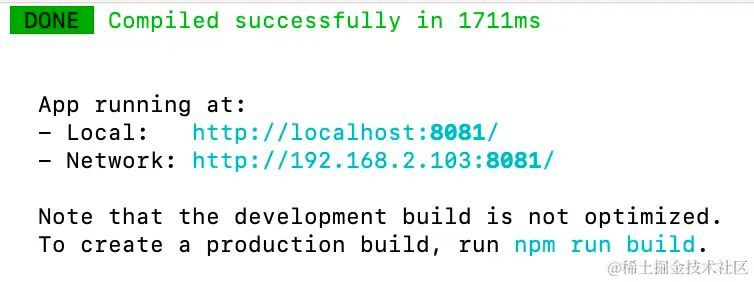

浏览器访问，会看到渲染出的页面：

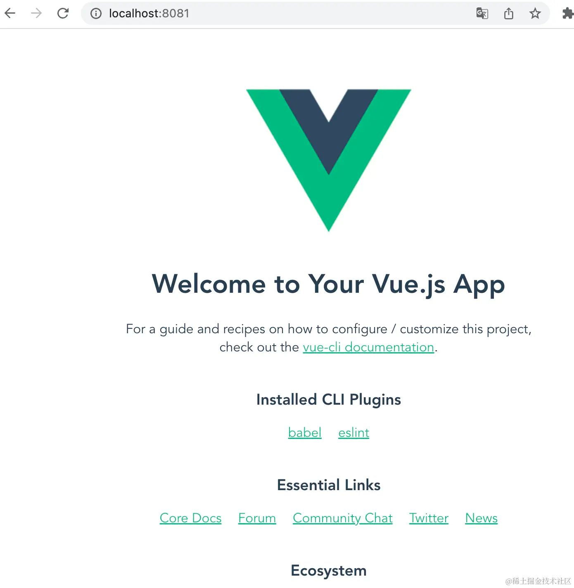

修改下 vue.config.js，把 devtool 改成 source-map：

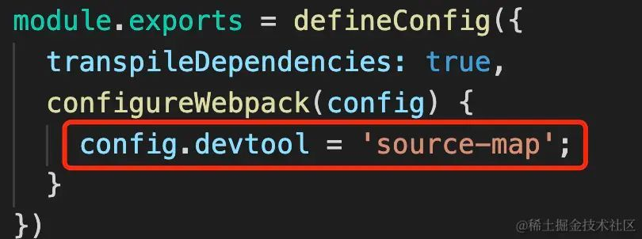

然后我们进行调试：

点击调试窗口的 create a launch.json file 来创建调试配置文件：

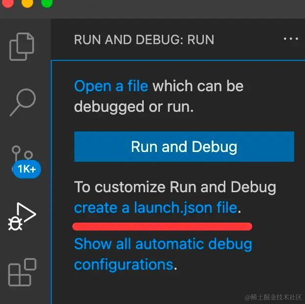

修改调试配置如下：

```json
{
    "type": "chrome",
    "request": "launch",
    "name": "调试 Vue 项目",
    "runtimeExecutable": "canary",
    "runtimeArgs": [
        "--auto-open-devtools-for-tabs",
    ],
    "userDataDir": false,
    "url": "http://localhost:8081"
}
```

这样就可以在 VSCode 里打断点调试了。

但是这样调试 Vue 源码的话还不够，你会发现调用栈里的路径是 node_modules 下的 runtime-core.esm-bundler.js：


这明显是经过编译打包之后的，而我们想要调试的是 Vue 最初的源码。

这就需要用到 sourcemap 了。

从 npm 下载的 vue 包是不带 sourcemap 的，我们需要把源码下载下来自己 build。

```bash

git clone https://github.com/vuejs/core vue3
```

下载 vue3 的代码，用 pnpm install 安装依赖（这是 vue3 指定的依赖管理工具）。

执行 pnpm run build，就会在每个包下产生 dist 目录：

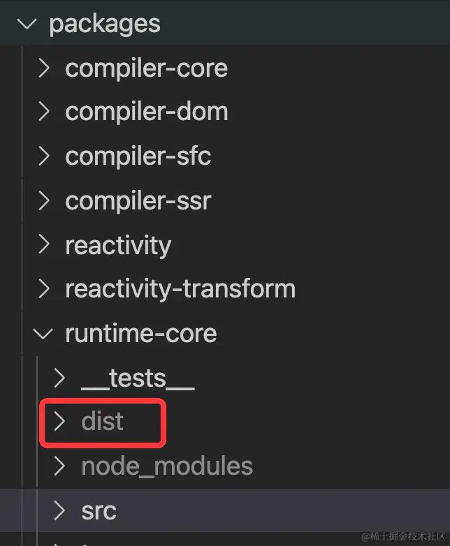

这时候的产物肯定是不带 sourcemap 的。

那难道也要像调试 React 源码那样改造 build 脚本么？

这个倒不用，vue3 源码里贴心的为需要生成 sourcemap 的情况做了支持。

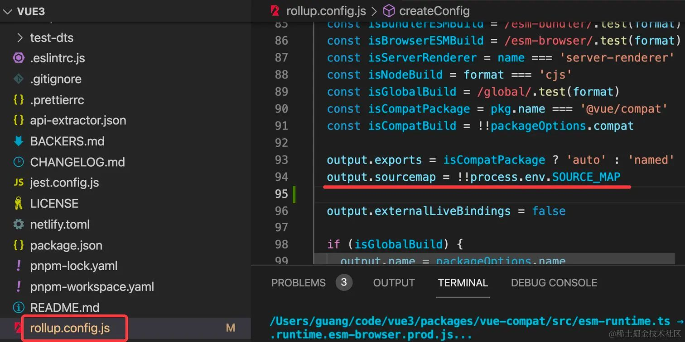

只要配置下这个环境变量就行。

执行 export SOURCE_MAP=true 然后再跑 pnpm run build：

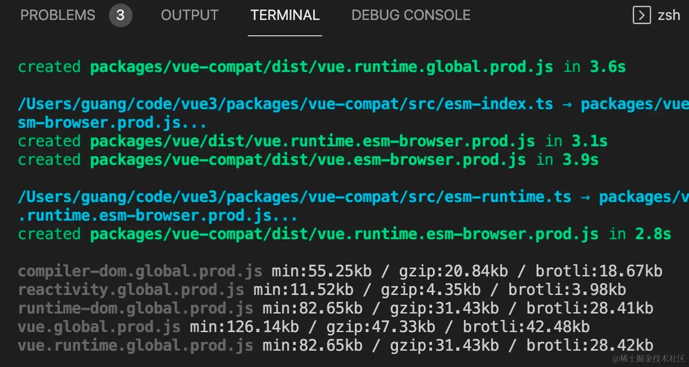

build 完成后，再去看包下的 dist 产物，你就会发现有 sourcemap 了：

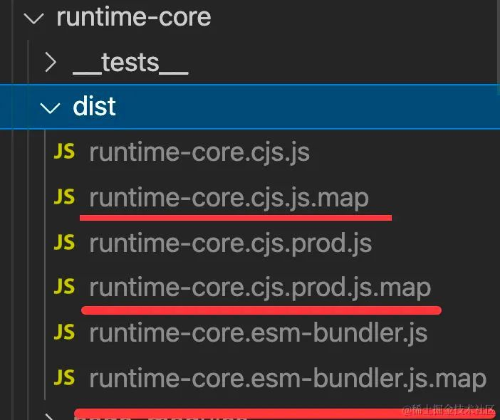

相比 react 源码生成 sourcemap 简单了很多。

把 runtime-core 包下的 dist 复制出来，覆盖 vue-demo 项目的 node_modules 下的 dist 目录：


重新跑 npm run serve，并且重新 debug：

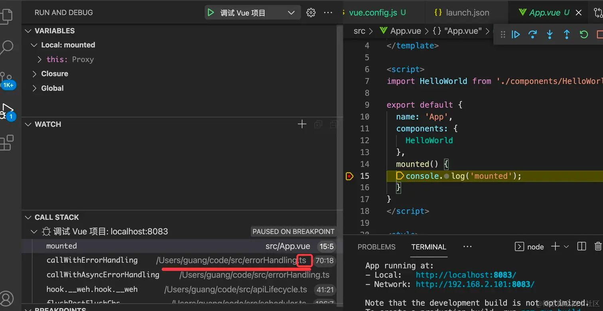

这时候你会发现调试的就是源码了，很明显是 src 下的 ts 文件。

对比下之前的：


是不是瞬间就懂了为什么要用 sourcemap 了？

当然，这里把 sourcemap 应用到项目里也没有 create-react-app 里那么费劲，明显是 vue-cli 对 node_modules 下的 sourcemap 做了支持，简单了很多。

只不过现在 sourcemap 到的路径不大对，没有 runtime-core 的包名，不能编辑：

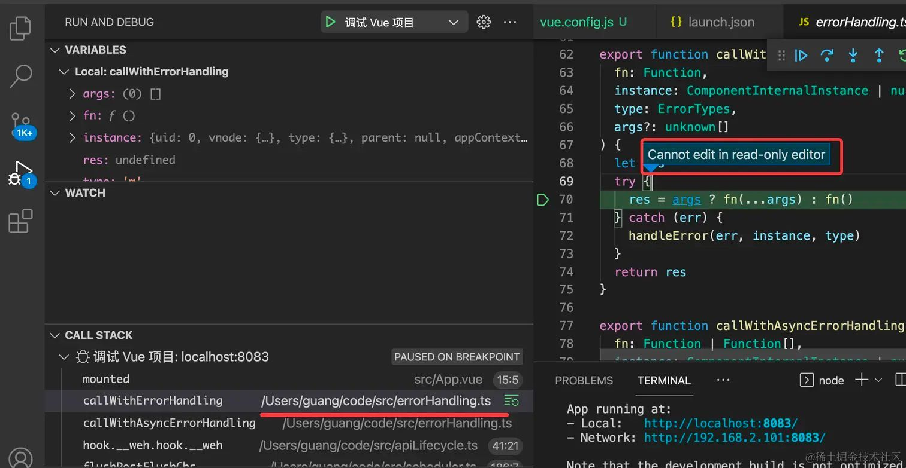

这种情况有两种处理方式，一种是配置下 sourceMapPathOverrides，把这段路径再做一次映射，映射到源码目录就可以了。

另一种方式就是改造下 vue3 的 build 脚本，让生成的 sourcemap 就直接是正确的路径。

我们采用第二种方式。

再次打开 vue3 源码目录，找到 rollup.config.js 里 sourcemap 配置的地方，添加一段配置:


```javascript
output.sourcemapPathTransform = (relativeSourcePath, sourcemapPath) => {
    const newSourcePath = path.join(path.dirname(sourcemapPath), relativeSourcePath);
    return newSourcePath;
}
```

这里的两个参数，sourcemapPath 就是 sourcemap 的绝对路径，比如这样 /Users/guang/code/vue3/packages/runtime-core/dist/runtime-core.cjs.js.map，而 relativeSourcePath 是 sourcemap 的路径到源码路径的相对路径，比如这样 ../src/errorHandling.ts

那要计算出源码的绝对路径，就可以先取 sourcemapPath 的目录路径，然后再根据相对路径查找到源码文件，这样就是源码的绝对路径了。

加了这个配置之后，重新 build 一下：


这时候生成的 sourcemap 里的源码路径就是绝对路径。

用新的 dist 目录覆盖 vue-demo 的 node_modules 下的 @vue/runtime-core 的 dist 目录，然后重新 npm run serve：

这时候调用栈中的 vue 代码就是源码的绝对路径了，能找到文件，自然也就不再是只读：

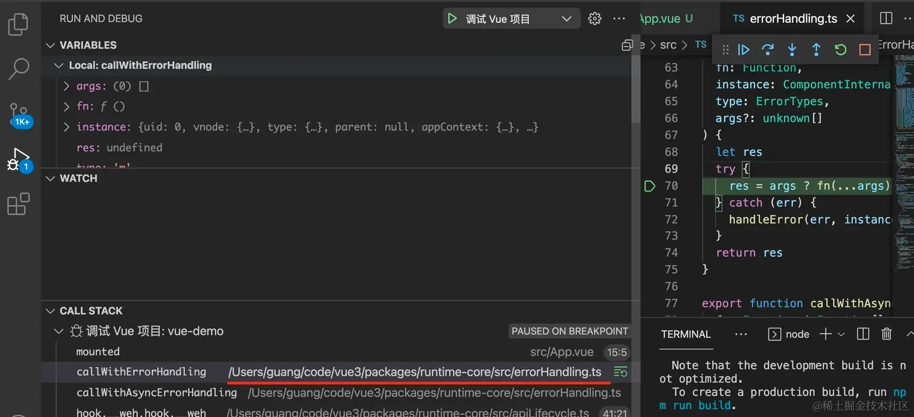

如果你重新跑 npm run serve，那可能是有 babel loader 的缓存：

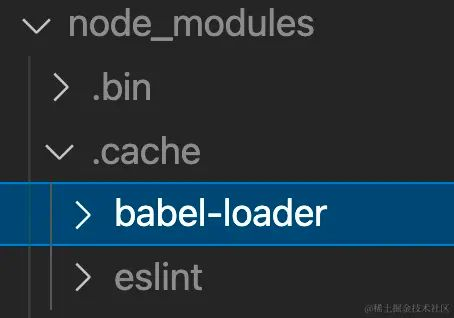

手动 rm -rf ./node_modules/.cache/babel-loader 就可以了。

当然，更好的体验还是像调试 React 代码那样，把 vue 源码和 vue-demo 项目放到同一个 workspace 下：

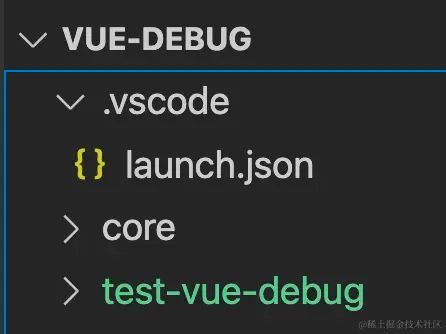

这里因为移动了 vue3 源码的位置，那 sourcemap 到的路径变了，所以还要进入 vue3 源码路径重新 build 依次，再把 sourcemap 复制到 vue-demo 目录的 node_modules 下。

再次调试，点击调用栈中的源码，就能直接在 workspace 里打开：


之后就能愉快的调试 vue 源码了。

对比下之前的调用栈：

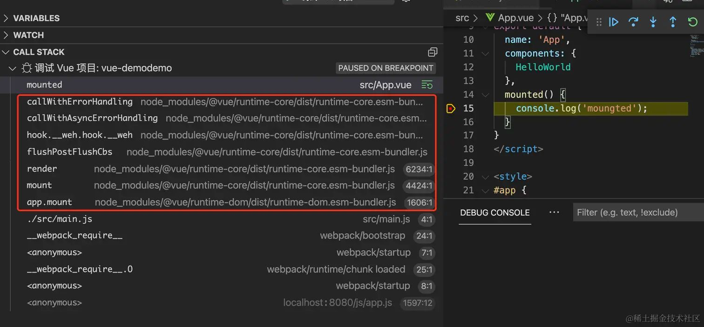

再看下现在的调用栈：

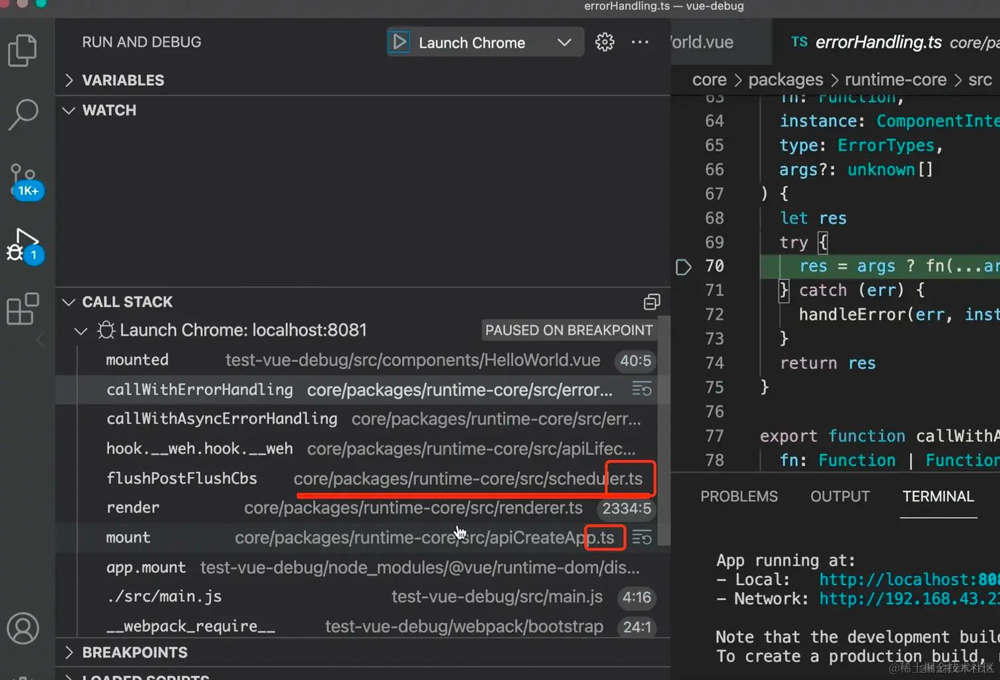

点击就可以打开源码目录下的对应文件。

你平时开发的项目也可以这样把 node_modules 下 的 @vue/runtime-core 的 dist 目录替换掉，这样调试项目之余，还可以看看源码。把 vue 也加到 workspace 那一步倒不是必须的。

有的同学用 vite 调试 vue3 源码，也可以，但要把 vue 的预加载禁用，不然路径就变了：

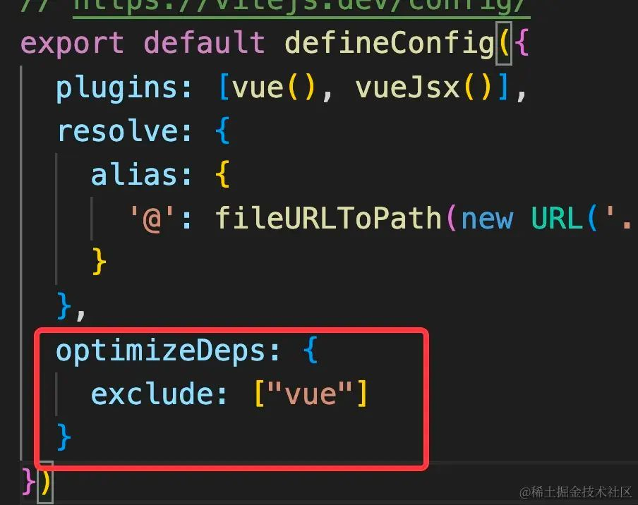

## 总结

这节我们调试了下 vue 源码，它同样也需要 sourcemap，我们下载了 vue 源码，然后 build 出了带有 sourcemap 的代码，覆盖 demo 项目的 node_modules 下的包，之后再次调试就可以直接调试源码了。

但是这时候 sourcemap 到的路径不对，所以源码文件是只读的。我们修改了 build 配置，通过 output.sourcemapPathTransform 修改了 sourcemap 到的源码地址，再次调试就能找到源码的绝对路径，这样内容就是可修改的了。

如果想点击调用栈直接在 workspace 打开对应的文件，这需要把 demo 项目和 vue3 源码项目放到一个 workspace 下，再次调试就可以了。

vue3 源码的调试整体比 react 源码调试简单不少，因为不管是生成 sourcemap 还是把 sourcemap 加到项目里，vue 都做了不错的支持。