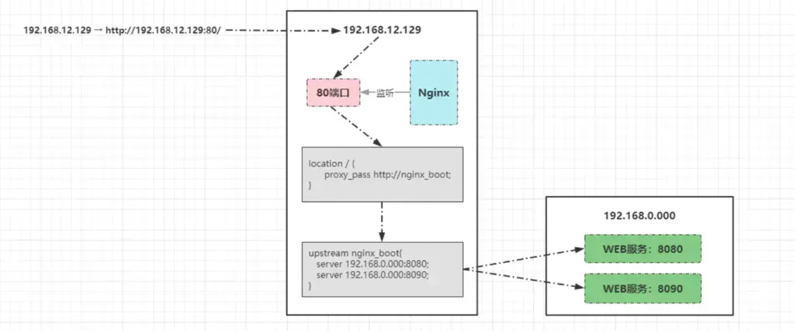
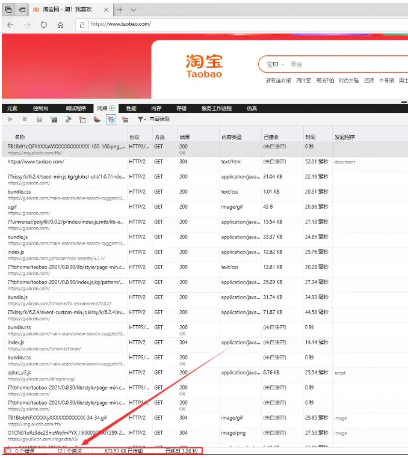
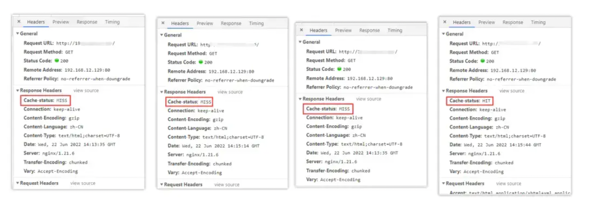
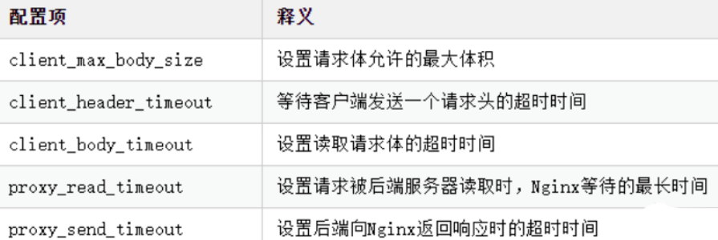

单体节点部署

①单体结构的部署方式无法承载日益增长的业务流量。

②当后端节点宕机后，整个系统会陷入瘫痪，导致整个项目不可用。


### **Nginx反向代理-负载均衡**

```java
@Controller  
public class IndexNginxController {  
    @Value("${server.port}")  
    private String port;  
  
    @RequestMapping("/")  
    public ModelAndView index(){  
        ModelAndView model = new ModelAndView();  
        model.addObject("port", port);  
        model.setViewName("index");  
        return model;  
    }  
}  
```

在该Controller类中，存在一个成员变量：port，它的值即是从application.properties配置文件中获取server.port值。当出现访问/资源的请求时，跳转前端index页面，并将该值携带返回。

前端的index.ftl文件代码如下：

```html
<html>  
  <head>  
    <title>Nginx演示页面</title>  
    <link href="nginx_style.css" rel="stylesheet" type="text/css"/>  
  </head>  
  <body>  
    <div style="border: 2px solid red;margin: auto;width: 800px;text-align: center">  
      <div  id="nginx_title">  
        <h1>欢迎来到 ${port}号！</h1>  
      </div>  
    </div>  
  </body>  
</html>  
```

nginx.conf的配置即可：

```nginx
upstream nginx_boot{  
  # 30s内检查心跳发送两次包，未回复就代表该机器宕机，请求分发权重比为1:2  
  server 192.168.0.000:8080 weight=100 max_fails=2 fail_timeout=30s;   
  server 192.168.0.000:8090 weight=200 max_fails=2 fail_timeout=30s;  
  # 这里的IP请配置成你WEB服务所在的机器IP  
}  

server {  
  location / {  
    root   html;  
    # 配置一下index的地址，最后加上index.ftl。
    index  index.html index.htm index.jsp index.ftl;  
    proxy_set_header Host $host;  
    proxy_set_header X-Real-IP $remote_addr;  
    proxy_set_header X-Forwarded-For $proxy_add_x_forwarded_for;  
    # 请求交给名为nginx_boot的upstream上  
    proxy_pass http://nginx_boot;  
  }  
}
```

##### **Nginx请求分发原理**

客户端发出的请求192.168.12.129最终会转变为：http://192.168.12.129:80/，然后再向目标IP发起请求，流程如下：



- 由于Nginx监听了192.168.12.129的80端口，所以最终该请求会找到Nginx进程；
- Nginx首先会根据配置的location规则进行匹配，根据客户端的请求路径/，会定位到location /{}规则；
- 然后根据该location中配置的proxy_pass会再找到名为nginx_boot的upstream；
- 最后根据upstream中的配置信息，将请求转发到运行WEB服务的机器处理，由于配置了多个WEB服务，且配置了权重值，因此Nginx会依次根据权重比分发请求。

### **Nginx动静分离**

动静分离应该是听的次数较多的性能优化方案，那先思考一个问题：**「「为什么需要做动静分离呢？它带来的好处是什么？」」** 其实这个问题也并不难回答，当你搞懂了网站的本质后，自然就理解了动静分离的重要性




当浏览器输入www.taobao.com访问淘宝首页时，打开开发者调试工具可以很明显的看到，首页加载会出现100+的请求数，而正常项目开发时，静态资源一般会放入到resources/static/目录下：


在项目上线部署时，这些静态资源会一起打成包，那此时思考一个问题：**「「假设淘宝也是这样干的，那么首页加载时的请求最终会去到哪儿被处理？」」** 答案毋庸置疑，首页100+的所有请求都会来到部署WEB服务的机器处理，那则代表着一个客户端请求淘宝首页，就会对后端服务器造成100+的并发请求。毫无疑问，这对于后端服务器的压力是尤为巨大的。

首页100+的请求中，是不是至少有60+是属于*.js、*.css、*.html、*.jpg.....这类静态资源的请求呢？答案是Yes。

既然有这么多请求属于静态的，这些资源大概率情况下，长时间也不会出现变动，那为何还要让这些请求到后端再处理呢？能不能在此之前就提前处理掉？当然OK，因此经过分析之后能够明确一点：**「「做了动静分离之后，至少能够让后端服务减少一半以上的并发量。」」** 到此时大家应该明白了动静分离能够带来的性能收益究竟有多大。


①先在部署Nginx的机器，Nginx目录下创建一个目录static_resources：

```bash
mkdir static_resources   
``` 

②将项目中所有的静态资源全部拷贝到该目录下，而后将项目中的静态资源移除重新打包。

③稍微修改一下nginx.conf的配置，增加一条location匹配规则：

```nginx
location ~ .*\.(html|htm|gif|jpg|jpeg|bmp|png|ico|txt|js|css){  
  root   /soft/nginx/static_resources;  
  expires 7d;  
}
```


最后解读一下那条location规则

- ~代表匹配时区分大小写
- .*代表任意字符都可以出现零次或多次，即资源名不限制
- \.代表匹配后缀分隔符.
- (html|...|css)代表匹配括号里所有静态资源类型

### **Nginx资源压缩**

建立在动静分离的基础之上，如果一个静态资源的Size越小，那么自然传输速度会更快，同时也会更节省带宽，因此我们在部署项目时，也可以通过Nginx对于静态资源实现压缩传输，一方面可以节省带宽资源，第二方面也可以加快响应速度并提升系统整体吞吐。


在Nginx也提供了三个支持资源压缩的模块ngx_http_gzip_module、ngx_http_gzip_static_module、ngx_http_gunzip_module，其中ngx_http_gzip_module属于内置模块，代表着可以直接使用该模块下的一些压缩指令

```nginx
http{
    # 开启压缩机制
    gzip on;
    # 指定会被压缩的文件类型(也可自己配置其他类型)
    gzip_types text/plain application/javascript text/css application/xml text/javascript image/jpeg image/gif image/png;
    # 设置压缩级别，越高资源消耗越大，但压缩效果越好
    gzip_comp_level 5;
    # 在头部中添加Vary: Accept-Encoding（建议开启）
    gzip_vary on;
    # 处理压缩请求的缓冲区数量和大小
    gzip_buffers 16 8k;
    # 对于不支持压缩功能的客户端请求不开启压缩机制
    gzip_disable "MSIE [1-6]\."; # 低版本的IE浏览器不支持压缩
    # 设置压缩响应所支持的HTTP最低版本
    gzip_http_version 1.1;
    # 设置触发压缩的最小阈值
    gzip_min_length 2k;
    # 关闭对后端服务器的响应结果进行压缩
    gzip_proxied off;
}
```

### **Nginx缓冲区**

先来思考一个问题，接入Nginx的项目一般请求流程为：“客户端→Nginx→服务端”，在这个过程中存在两个连接：“客户端→Nginx、Nginx→服务端”，那么两个不同的连接速度不一致，就会影响用户的体验（比如浏览器的加载速度跟不上服务端的响应速度）。

其实也就类似电脑的内存跟不上CPU速度，所以对于用户造成的体验感极差，因此在CPU设计时都会加入三级高速缓冲区，用于缓解CPU和内存速率不一致的矛盾。在Nginx也同样存在缓冲区的机制，主要目的就在于：**「「用来解决两个连接之间速度不匹配造成的问题」」** ，有了缓冲后，Nginx代理可暂存后端的响应，然后按需供给数据给客户端。先来看看一些关于缓冲区的配置项：

- proxy_buffering：是否启用缓冲机制，默认为on关闭状态。
- client_body_buffer_size：设置缓冲客户端请求数据的内存大小。
- proxy_buffers：为每个请求/连接设置缓冲区的数量和大小，默认4 4k/8k。
- proxy_buffer_size：设置用于存储响应头的缓冲区大小。
- proxy_busy_buffers_size：在后端数据没有完全接收完成时，Nginx可以将busy状态的缓冲返回给客户端，该参数用来设置busy状态的buffer具体有多大，默认为proxy_buffer_size*2。
- proxy_temp_path：当内存缓冲区存满时，可以将数据临时存放到磁盘，该参数是设置存储缓冲数据的目录。
- path是临时目录的路径。

- 语法：proxy_temp_path path; path是临时目录的路径

- proxy_temp_file_write_size：设置每次写数据到临时文件的大小限制。
- proxy_max_temp_file_size：设置临时的缓冲目录中允许存储的最大容量。
- 非缓冲参数项：

- proxy_connect_timeout：设置与后端服务器建立连接时的超时时间。
- proxy_read_timeout：设置从后端服务器读取响应数据的超时时间。
- proxy_send_timeout：设置向后端服务器传输请求数据的超时时间。

具体的nginx.conf配置如下：

```nginx
http{  
    proxy_connect_timeout 10;  
    proxy_read_timeout 120;  
    proxy_send_timeout 10;  
    proxy_buffering on;  
    client_body_buffer_size 512k;  
    proxy_buffers 4 64k;  
    proxy_buffer_size 16k;  
    proxy_busy_buffers_size 128k;  
    proxy_temp_file_write_size 128k;  
    proxy_temp_path /soft/nginx/temp_buffer;  
}
```

上述的缓冲区参数，是基于每个请求分配的空间，而并不是所有请求的共享空间。当然，具体的参数值还需要根据业务去决定，要综合考虑机器的内存以及每个请求的平均数据大小。

“最后提一嘴：使用缓冲也可以减少即时传输带来的带宽消耗。

### **Nginx缓存机制**

对于性能优化而言，缓存是一种能够大幅度提升性能的方案，因此几乎可以在各处都能看见缓存，如客户端缓存、代理缓存、服务器缓存等等，Nginx的缓存则属于代理缓存的一种。对于整个系统而言，加入缓存带来的优势额外明显：

- 减少了再次向后端或文件服务器请求资源的带宽消耗。
- 降低了下游服务器的访问压力，提升系统整体吞吐。
- 缩短了响应时间，提升了加载速度，打开页面的速度更快。

那么在Nginx中，又该如何配置代理缓存呢？先来看看缓存相关的配置项：

**「proxy_cache_path」**：代理缓存的路径。

语法：

```nginx
proxy_cache_path path [levels=levels] [use_temp_path=on|off] keys_zone=name:size [inactive=time] [max_size=size] [manager_files=number] [manager_sleep=time] [manager_threshold=time] [loader_files=number] [loader_sleep=time] [loader_threshold=time] [purger=on|off] [purger_files=number] [purger_sleep=time] [purger_threshold=time];
```

解释一下每个参数项的含义：

- path：缓存的路径地址。
- levels：缓存存储的层次结构，最多允许三层目录。
- use_temp_path：是否使用临时目录。
- keys_zone：指定一个共享内存空间来存储热点Key(1M可存储8000个Key)。
- inactive：设置缓存多长时间未被访问后删除（默认是十分钟）。
- max_size：允许缓存的最大存储空间，超出后会基于LRU算法移除缓存，Nginx会创建一个Cache manager的进程移除数据，也可以通过purge方式。
- manager_files：manager进程每次移除缓存文件数量的上限。
- manager_sleep：manager进程每次移除缓存文件的时间上限。
- manager_threshold：manager进程每次移除缓存后的间隔时间。
- loader_files：重启Nginx载入缓存时，每次加载的个数，默认100。
- loader_sleep：每次载入时，允许的最大时间上限，默认200ms。
- loader_threshold：一次载入后，停顿的时间间隔，默认50ms。
- purger：是否开启purge方式移除数据。
- purger_files：每次移除缓存文件时的数量。
- purger_sleep：每次移除时，允许消耗的最大时间。
- purger_threshold：每次移除完成后，停顿的间隔时间。

常见缓存配置

```nginx
http{  
    # 设置缓存的目录，并且内存中缓存区名为hot_cache，大小为128m，  
    # 三天未被访问过的缓存自动清楚，磁盘中缓存的最大容量为2GB。
    proxy_cache_path /soft/nginx/cache levels=1:2 keys_zone=hot_cache:128m inactive=3d max_size=2g;  
      
    server{  
        location / {  
            # 使用名为nginx_cache的缓存空间  
            proxy_cache hot_cache;  
            # 对于200、206、304、301、302状态码的数据缓存1天  
            proxy_cache_valid 200 206 304 301 302 1d;  
            # 对于其他状态的数据缓存30分钟  
            proxy_cache_valid any 30m;  
            # 定义生成缓存键的规则（请求的url+参数作为key）  
            proxy_cache_key $host$uri$is_args$args;  
            # 资源至少被重复访问三次后再加入缓存  
            proxy_cache_min_uses 3;  
            # 出现重复请求时，只让一个去后端读数据，其他的从缓存中读取  
            proxy_cache_lock on;  
            # 上面的锁超时时间为3s，超过3s未获取数据，其他请求直接去后端  
            proxy_cache_lock_timeout 3s;  
            # 对于请求参数或cookie中声明了不缓存的数据，不再加入缓存  
            proxy_no_cache $cookie_nocache $arg_nocache $arg_comment;  
            # 在响应头中添加一个缓存是否命中的状态（便于调试）  
            add_header Cache-status $upstream_cache_status;  
        }  
    }  
}
```

效果如下



第一次访问时，因为还没有请求过资源，所以缓存中没有数据，因此没有命中缓存。第二、三次，依旧没有命中缓存，直至第四次时才显示命中，这是为什么呢？因为在前面的缓存配置中，我们配置了加入缓存的最低条件为：**「「资源至少要被请求三次以上才会加入缓存。」」** 这样可以避免很多无效缓存占用空间。


##### **缓存清理**

当缓存过多时，如果不及时清理会导致磁盘空间被“吃光”，因此我们需要一套完善的缓存清理机制去删除缓存，在之前的proxy_cache_path参数中有purger相关的选项，开启后可以帮我们自动清理缓存，但遗憾的是：**purger系列参数只有商业版的NginxPlus才能使用，因此需要付费才可使用。**

不过天无绝人之路，我们可以通过强大的第三方模块ngx_cache_purge来替代，先来安装一下该插件：①首先去到Nginx的安装目录下，创建一个cache_purge


### **Nginx实现IP黑白名单**

有时候往往有些需求，可能某些接口只能开放给对应的合作商，或者购买/接入API的合作伙伴，那么此时就需要实现类似于IP白名单的功能。而有时候有些恶意攻击者或爬虫程序，被识别后需要禁止其再次访问网站，因此也需要实现IP黑名单。那么这些功能无需交由后端实现，可直接在Nginx中处理。

Nginx做黑白名单机制，主要是通过allow、deny配置项来实现：

```nginx
allow xxx.xxx.xxx.xxx; # 允许指定的IP访问，可以用于实现白名单。  
deny xxx.xxx.xxx.xxx; # 禁止指定的IP访问，可以用于实现黑名单。  
```

要同时屏蔽/开放多个IP访问时，如果所有IP全部写在nginx.conf文件中定然是不显示的，这种方式比较冗余，那么可以新建两个文件BlocksIP.conf、WhiteIP.conf：

```nginx
# --------黑名单：BlocksIP.conf---------  
deny 192.177.12.222; # 屏蔽192.177.12.222访问  
deny 192.177.44.201; # 屏蔽192.177.44.201访问  
deny 127.0.0.0/8; # 屏蔽127.0.0.1到127.255.255.254网段中的所有IP访问  
  
# --------白名单：WhiteIP.conf---------  
allow 192.177.12.222; # 允许192.177.12.222访问  
allow 192.177.44.201; # 允许192.177.44.201访问  
allow 127.45.0.0/16; # 允许127.45.0.1到127.45.255.254网段中的所有IP访问  
deny all; # 除开上述IP外，其他IP全部禁止访问  
```

可以再将这两个文件在nginx.conf中导入：

```nginx
http{  
    # 屏蔽该文件中的所有IP  
    include /soft/nginx/IP/BlocksIP.conf;   
 server{  
    location xxx {  
        # 某一系列接口只开放给白名单中的IP  
        include /soft/nginx/IP/blockip.conf;   
    }  
 }  
}
```

### **Nginx跨域配置**

```nginx
location / {  
    # 允许跨域的请求，可以自定义变量$http_origin，*表示所有  
    add_header 'Access-Control-Allow-Origin' *;  
    # 允许携带cookie请求  
    add_header 'Access-Control-Allow-Credentials' 'true';  
    # 允许跨域请求的方法：GET,POST,OPTIONS,PUT  
    add_header 'Access-Control-Allow-Methods' 'GET,POST,OPTIONS,PUT';  
    # 允许请求时携带的头部信息，*表示所有  
    add_header 'Access-Control-Allow-Headers' *;  
    # 允许发送按段获取资源的请求  
    add_header 'Access-Control-Expose-Headers' 'Content-Length,Content-Range';  
    # 一定要有！！！否则Post请求无法进行跨域！
    # 在发送Post跨域请求前，会以Options方式发送预检请求，服务器接受时才会正式请求  
    if ($request_method = 'OPTIONS') {  
        add_header 'Access-Control-Max-Age' 1728000;  
        add_header 'Content-Type' 'text/plain; charset=utf-8';  
        add_header 'Content-Length' 0;  
        # 对于Options方式的请求返回204，表示接受跨域请求  
        return 204;  
    }  
}
```

### **Nginx防盗链设计**

**盗链即是指外部网站引入当前网站的资源对外展示**

“好比壁纸网站X站、Y站，X站是一点点去购买版权、签约作者的方式，从而积累了海量的壁纸素材，但Y站由于资金等各方面的原因，就直接通过 img src="X站/xxx.jpg" /这种方式照搬了X站的所有壁纸资源，继而提供给用户下载。


Nginx的防盗链机制实现，跟一个头部字段：Referer有关，该字段主要描述了当前请求是从哪儿发出的，那么在Nginx中就可获取该值，然后判断是否为本站的资源引用请求，如果不是则不允许访问。Nginx中存在一个配置项为valid_referers，正好可以满足前面的需求

```nginx
valid_referers none | blocked | server_names | string ...;
```

- none：表示接受没有Referer字段的HTTP请求访问。
- blocked：表示允许http://或https//以外的请求访问。
- server_names：资源的白名单，这里可以指定允许访问的域名。
- string：可自定义字符串，支配通配符、正则表达式写法。


```nginx
# 在动静分离的location中开启防盗链机制  
location ~ .*\.(html|htm|gif|jpg|jpeg|bmp|png|ico|txt|js|css){  
    # 最后面的值在上线前可配置为允许的域名地址  
    valid_referers blocked 192.168.12.129;  
    if ($invalid_referer) {  
        # 可以配置成返回一张禁止盗取的图片  
        # rewrite   ^/ http://xx.xx.com/NO.jpg;  
        # 也可直接返回403  
        return   403;  
    }  
      
    root   /soft/nginx/static_resources;  
    expires 7d;  
}
```

### **Nginx大文件传输配置**

在某些业务场景中需要传输一些大文件，但大文件传输时往往都会会出现一些Bug，比如文件超出限制、文件传输过程中请求超时等，那么此时就可以在Nginx稍微做一些配置，先来了解一些关于大文件传输时可能会用的配置项：

在传输大文件时，client_max_body_size、client_header_timeout、proxy_read_timeout、proxy_send_timeout这四个参数值都可以根据自己项目的实际情况来配置。

