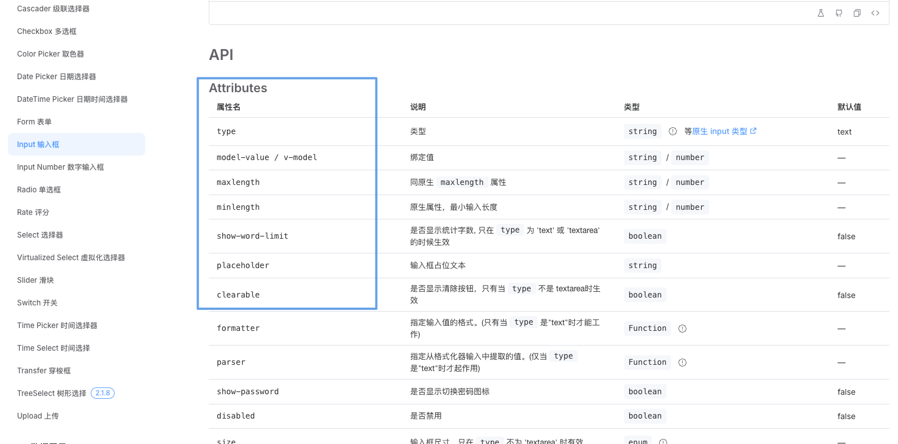
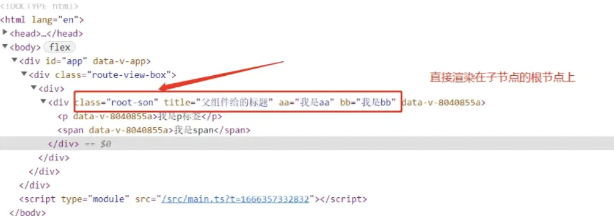
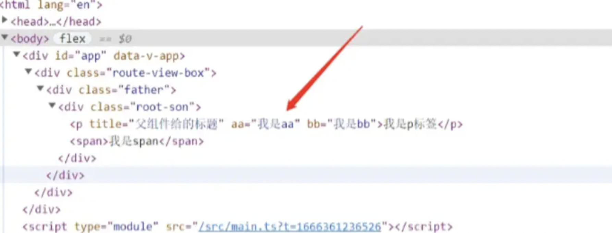
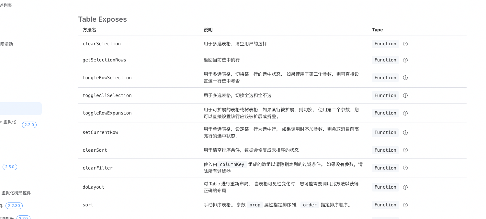
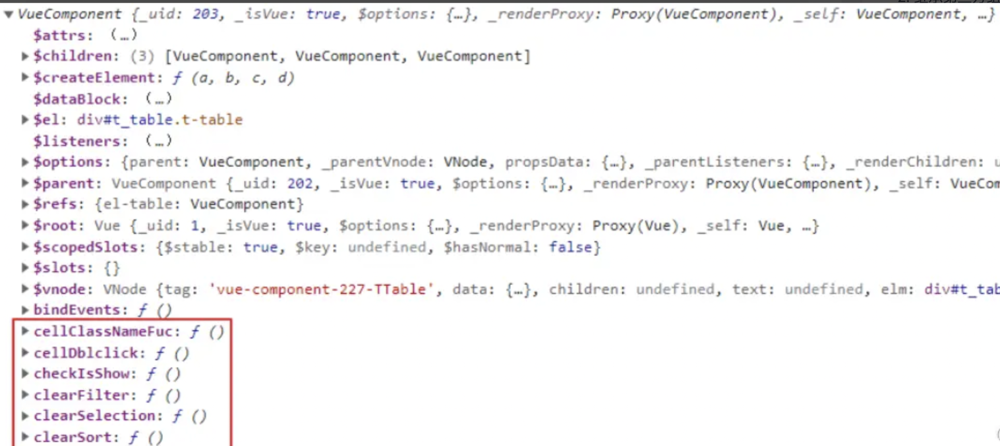

在开发 Vue 项目中我们一般使用第三方 UI 组件库进行开发，如 `Element-Plus`, 但是这些组件库提供的组件并不一定满足我们的需求，这时我们可以通过对组件库的组件进行二次封装，来满足我们特殊的需求。

对于封装组件有一个大原则就是我们应该尽量保持原有组件的接口，除了我们需要封装的功能外，我们不应该改变原有组件的接口，**即保持原有组件提供的接口（属性、方法、事件）不变**。


## 一、保持原有组件的接口

这里我们对 Element-plus 的 input 组件进行简单的二次封装，封装一个 MyInput 组件，代码的结构如下：

```javascript
// 引入组件进行使用
  <template>
  <MyInput></MyInput>
  </template>


  // MyInput.vue
  <template>
  <div class="my-input">
  <el-input></el-input>
  </div>
  </template>
```

### 1. 继承第三方组件的 Attributes 属性

如果我们往 MyInput 组件传入一些属性，并且想要将这些属性传给 el-input，最简单的方式就是在组件中一个个的去定义 `props`，然后再传给 el-input，但是这种方法非常麻烦，毕竟 `el-input` 就有二十几个属性（`Attributes`）



这个时候可以使用 `$attrs`（属性透传）去解决这个问题，先来看下 Vue 官方文档对 `$attrs` 的解释：包含了父作用域中不作为组件 props 或自定义事件的 attribute 绑定和事件；当一个组件没有声明任何 prop 时，这里会包含所有父作用域的绑定，并且可以通过 v-bind="$attrs" 传入内部的 UI 组件中——这在创建高阶的组件时会非常有用。

```vue
<MyInput :size="inputSize" :name="userName" :clearable="clearable" ></MyInput>
<template>
    <div class="my-input">
      <el-input v-bind="filteredAttrs"></el-input>

      <!-- 如果不希望过滤掉某些属性 可以直接使用 $attrs -->
      <el-input v-bind="$attrs"></el-input>
    </div>
  </template>

    <script lang="ts" setup>
    import {useAttrs,computed,ref } from 'vue'
    import { ElInput } from 'element-plus'
    defineOptions({
    name: 'MyInput'
    })

    // 接收 name，其余属性都会被透传给 el-input
    defineProps({
    name: String
    });

    // 如果我们不希望透传某些属性比如class, 我们可以通过useAttrs来实现
    const attrs = useAttrs()
    const filteredAttrs = computed(() => {
      return { ...attrs, class: undefined };
    });
```

对于 props，最好用对象的写法，这样可以针对每个属性设置类型、默认值或自定义校验属性的值，此外还可以通过 type、validator 等方式对输入进行验证

```javascript
const props = {
  viewport: {
    type: (typeof window !== 'undefined' ? window.HTMLElement : Object) as PropType<HTMLElement>,
    default: () => null,
  },
  threshold: { 
    type: String, 
    default: '0px' 
  },
  direction: {
    type: String,
    default: 'vertical',
    validator: (v) => ['vertical', 'horizontal'].includes(v),
  },
};
```

这里我们再来聊下 `inheritAttrs` 属性：默认情况下，父组件传递的，但没有被子组件解析为 props 的 attributes 绑定会被 “透传”。这意味着当我们有一个单根节点的子组件时，这些绑定会被作为一个常规的 HTML attribute 应用在子组件的根节点元素上，当你编写的组件想要在一个目标元素或其他组件外面包一层时，可能并不期望这样的行为。

我们可以通过设置 `inheritAttrs` 为 `false` 来禁用这个默认行为。这些 attributes 可以通过 `$attrs` 这个实例属性来访问，并且可以通过 `v-bind` 来显式绑定在一个非根节点的元素上。 下面来看一个具体的例子：

父组件：

```vue
<template>
  <div>
    <TestCom title="父组件给的标题" aa="我是aa" bb="我是bb"></TestCom>
  </div>
</template>
<script setup lang="ts">
  import TestCom from "../../components/TestCom.vue"
</script>
```

子组件：

```vue
<template>
    <div class="root-son">
      <p>我是p标签</p>
      <span>我是span</span>
    </div>
  </template>
```



因为在默认情况下，父组件的属性会直接渲染在子组件的根节点上，但是有些情况我们希望是渲染在指定的节点上，那怎么处理这问题呢？使用 `$attrs` 和 `inheritAttrs: false` 就可以完美的解决这个问题。

```vue
template>
    <div class="root-son">
      <p v-bind="$attrs">我是p标签</p>
      <span>我是span</span>
    </div>
  </template>
    <script lang="ts">
    export default {
    inheritAttrs: false,
    }
  </script>
```




### 2. 继承第三方组件的 Event 事件

跟上面的属性传递一样，如果我们往 MyInput 组件传入一些事件，并且想要将这些事件传给 el-input，这里需要用到 `$listeners`


```vue
<MyInput @change="change" @focus="focus" @input="input"></MyInput>
// Vue2
  <template>
    <div class="my-input">
    <el-input v-bind="$attrs" v-on="$listeners"></el-input>
    </div>
    </template>

    // Vue3
    <template>
    <div class="my-input">
    <!-- 在 Vue3 中，取消了$listeners这个组件实例的属性，将其事件的监听都整合到了$attrs上 -->

    <!-- 因此直接通过v-bind=$attrs属性就可以进行props属性和event事件的透传 -->
    <el-input v-bind="$attrs"></el-input>

    </div>
    </template>
```

### 3. 使用第三方组件的 Slots

插槽也是一样的道理，比如 `el-input` 就有4个 Slot，我们不应该在组件中一个个的去手动添加 `<slot name="prefix">`，因此需要使用 `$slots`


```vue
<template>
    <MyInput :placeholder="inputPlaceholder" @input="inputHandle">
      <template #prepend>
        <el-select v-model="select" placeholder="请选择" style="width: 115px">
          <el-option label="HTTPS" value="1" />
          <el-option label="HTTP" value="2" />
        </el-select>
      </template>
      <template #append>
        <el-button :icon="Search" />
      </template>
    </MyInput>
  </template>
```

在 Vue2 中，需要用到 `$slots`（插槽） 和 `$scopedSlots`（作用域插槽）：

```vue
<template>
    <div class="my-input">
      <el-input
        v-model="childSelectedValue"
        v-bind="attrs"
        v-on="$listeners"
        >
        <!-- 遍历子组件非作用域插槽，并对父组件暴露 -->
        <template v-for="(index, name) in $slots" v-slot:[name]>
          <slot :name="name" />
        </template>
        <!-- 遍历子组件作用域插槽，并对父组件暴露 -->
        <template v-for="(index, name) in $scopedSlots" v-slot:[name]="data">
          <slot :name="name" v-bind="data"></slot>
        </template>
      </el-input>
    </div>
  </template>
```

在 Vue3 中，取消了作用域插槽 `$scopedSlots`，将所有插槽都统一在 `$slots` 当中：

```vue
<template>
    <div class="my-input">
      <el-input
        v-model="childSelectedValue"
        v-bind="attrs"
        v-on="$listeners"
        >
        <template #[slotName]="slotProps" v-for="(slot, slotName) in $slots" >
          <slot :name="slotName" v-bind="slotProps"></slot>
        </template>
      </el-input>
    </div>
  </template>
```

### 4. 使用第三方组件的Methods

有些时候我们想要使用组件的一些方法，比如 `el-table` 提供9个方法，如何在父组件（也就是封装的组件）中使用这些方法呢？其实可以通过 ref 链式调用，比如 `this.$refs.tableRef.$refs.table.clearSort()`，但是这样太麻烦了，代码的可读性差；更好的解决方法：将所有的方法暴露出来，供父组件通过 ref 调用！



在 Vue2 中，可以将 `el-table` 提供方法提取到实例上：

```vue
<template>
  <div class="my-table">
    <el-table ref="el-table"></el-table>
  </div>
</template>

<Script>
export default {
  mounted() {
    this.extendMethod()
  },
  methods: {
    extendMethod() {
      const refMethod = Object.entries(this.$refs['el-table'])
      for (const [key, value] of refMethod) {
        if (!(key.includes('$') || key.includes('_'))) {
          this[key] = value
      }
    }
  },
};
</Script>
```



```vue
<template>
  <MyTable ref="tableRef"></MyTable>
</template>

<Script>
export default {
  mounted() {
    console.log(this.$refs.tableRef.clearSort())
  }
};
</Script>
```

在 Vue3 中的使用方法如下：

```vue
<template>
  <div class="my-table">
    <el-table ref="table"></el-table>
  </div>
</template>

<script lang="ts" setup>
import { ref, onMounted } from 'vue'
import { ElTable } from 'element-plus'

const table = ref();

onMounted(() => { 
    const entries = Object.entries(table.value); 
    for (const [method, fn] of entries) { 
        expose[method] = fn; 
    } 
}); 
defineExpose(expose);
<template>
  <MyTable ref="tableRef"></MyInput>
</template>

<script lang="ts" setup>
import { ref,onMounted } from 'vue'

const tableRef = ref()

onMounted(() => {
  console.log(tableRef.value);
  // 调用子组件中table的方法
  tableRef.value.clearSort()
    
})
</script>
```

## 二、v-model 实现双向绑定

我们在封装组件的时候，难免会用到一些表单组件，需要使用 v-model，这个时候可能会遇到一系列的问题，为了更好的解决可能会出现的问题，我们有必要先来了解下关于 v-model 的知识。

### 1. v-model在Vue2和Vue3中的区别

`v-model` 本质上是一个绑定属性和事件的语法糖，在 Vue2 和 Vue3 中是有一定的区别的，这里只简单介绍下，想了解更多的内容请查阅相关资料！

在 Vue2 中：

```vue
<!-- 子组件 -->
<template>
  <div>
    <input type="text" :value="value" @input="$emit('input', $event.target.value)">
  </div>
</template>

<script>
export default {
  props: {
    value: String,  // 默认接收一个名为 value 的 prop
  }
}
</script>
<!-- 父组件 -->
<my-input v-model="msg"></my-input>
// 等同于
<my-input :value="msg" @input="msg = $event">
```

在 Vue3 中：

```vue
<!-- 父组件 -->
<template>
  <my-input v-model="msg"></my-input>
  <!-- 等同于 -->
  <my-input :modelValue="msg" @update:modelValue="msg = $event"></my-input>
</template>
<script setup lang="ts">
import { ref } from 'vue'
const msg = ref('hello')
</script>

<!-- 子组件 -->
<template>
  <el-input :modelValue="modelValue" @update:modelValue="handleValueChange"></el-input>
</template>
<script setup lang="ts">
const props = defineProps({
  modelValue: {
    type: String,
    default: '',
  }
});

const emit = defineEmits(['update:modelValue']);

const handleValueChange = (value) => {
    emit('update:modelValue', value)
}
</script>
```

### 2. 避免违背Vue的单向数据流

我们来看下面的情况，父组件和子组件中都使用了 v-model，并且绑定的是同一个变量，这个时候就会出问题了，因为子组件直接更改了父组件的数据，违背了单向数据流，这样会导致如果出现数据问题不好调试，无法定位出现问题的根源。

```vue
<!-- 父组件 -->
<my-input v-model="msg"></my-input>

<!-- 子组件 -->
<template>
  <el-input v-model="msg"></el-input>
</template>
<script setup lang="ts">
const props = defineProps({
  msg: {
    type: String,
    default: '',
  }
});
</script>
```

那么有没有方法解决呢？我这里提供了两种解决方法，这里均以 Vue3 的写法为主

第一种是：`将 v-model 拆开，通过 emit 让父组件去修改数据`

```vue
<!-- 父组件 -->
<template>
  <my-input v-model="msg"></my-input>
</template>
<script setup lang="ts">
import { ref } from 'vue'
const msg = ref('hello')
</script>

<!-- 子组件 -->
<template>
  <el-input :modelValue="modelValue" @update:modelValue="handleValueChange"></el-input>
</template>
<script setup lang="ts">
const props = defineProps({
  modelValue: {
    type: String,
    default: '',
  }
});

const emit = defineEmits(['update:modelValue']);

const handleValueChange = (value) => {
    emit('update:modelValue', value)
}
</script>
```

第二种方法：`使用计算属性的 get set 方法`

```vue
<!-- 父组件 -->
<template>
  <my-input v-model="msg"></my-input>
</template>
<script setup lang="ts">
import { ref } from 'vue'
const msg = ref('hello')
</script>

<!-- 子组件 -->
<template>
  <el-input v-model="inputVal"></el-input>
</template>
<script setup lang="ts">
import { computed } from 'vue';
const props = defineProps({
  modelValue: {
    type: String,
    default: '',
  }
});

const emit = defineEmits(['update:modelValue']);

const inputVal = computed(() => {
  get() {
    return props.modelValue
  },
  set(val) {
    emit('update:modelValue', val)
  }
})
</script>
```

### 3. 使用多个v-model绑定对象属性

现在看起来是没有什么问题，但是如果子组件中有多个表单项（如下面的例子所示），不管是上面哪种方法，都要写很多重复的代码，所以我们需要去寻找解决的办法。

```vue
<!-- 父组件 -->
<template>
  <my-input v-model="formList"></my-input>
</template>
<script setup lang="ts">
import { ref } from 'vue'
const formList = ref({
  text: '',
  password: '',
  name: ''
})
</script>

<!-- 子组件 -->
<template>
  <el-input v-model="name"></el-input>
  <el-input v-model="text"></el-input>
  <el-input v-model="password"></el-input>
</template>
<script setup lang="ts">
import { computed } from 'vue';
const props = defineProps({
  modelValue: {
    type: Object,
    default: () => {},
  }
});

const emit = defineEmits(['update:modelValue']);

const name = computed(() => {
  get() {
    return props.modelValue.name
  },
  set(val) {
    emit('update:modelValue', {
      ...props.modelValue,
      name: val
    })
  }
})

const text = computed(() => {
  get() {
    return props.modelValue.text
  },
  set(val) {
    emit('update:modelValue', {
      ...props.modelValue,
      text: val
    })
  }
})

const password = computed(() => {
  get() {
    return props.modelValue.password
  },
  set(val) {
    emit('update:modelValue', {
      ...props.modelValue,
      password: val
    })
  }
})
</script>
```

上面使用计算属性监听单个属性，所以需要每个属性都写一遍，我们可以考虑在计算属性中监听整个对象：

```vue
<!-- 父组件 -->
<template>
  <my-input v-model="formList"></my-input>
</template>
<script setup lang="ts">
import { ref } from 'vue'
const formList = ref({
  text: '',
  password: '',
  name: ''
})
</script>

<!-- 子组件 -->
<template>
  <el-input v-model="modelList.name"></el-input>
  <el-input v-model="modelList.text"></el-input>
  <el-input v-model="modelList.password"></el-input>
</template>
<script setup lang="ts">
import { computed } from 'vue';
const props = defineProps({
  modelValue: {
    type: Object,
    default: () => {},
  }
});

const emit = defineEmits(['update:modelValue']);

const modelList = computed(() => {
  get() {
    return props.modelValue
  },
  set(val) {
    emit('update:modelValue', val)
  }
})
</script>
```

这样看起来没什么问题，读取属性的时候能正常调用 get，但是设置属性的时候却无法触发 set，原因是 `modelList.value = xxx`，才会触发 set，而 `modelList.value.name = xxx`，无法触发。这个时候，`Proxy` 代理对象可以完美的解决这个问题：

```vue
<!-- 父组件 -->
<template>
  <my-input v-model="formList"></my-input>
</template>
<script setup lang="ts">
import { ref } from 'vue'
const formList = ref({
  text: '',
  password: '',
  name: ''
})
</script>

<!-- 子组件 -->
<template>
  <el-input v-model="modelList.name"></el-input>
  <el-input v-model="modelList.text"></el-input>
  <el-input v-model="modelList.password"></el-input>
</template>
<script setup lang="ts">
import { computed } from 'vue';
const props = defineProps({
  modelValue: {
    type: Object,
    default: () => {},
  }
});

const emit = defineEmits(['update:modelValue']);

const modelList = computed(() => {
  get() {
    return new Proxy(props.modelValue, {
      get(target, key) {
        return Reflect.get(target, key)
      },
      set(target, key, value) {
        emit('update:modelValue',{
          ...target,
          [key]: value
        })
        return true
      }
    })
  },
  set(val) {
    emit('update:modelValue', val)
  }
})
</script>
```

现在已经能够把上面的问题都解决了，我们还可以考虑把这段代码进行封装，可以在多处引入进行使用： `useVModel.ts`，其实 vueuse 里面有提供了这么一个方法，基本的逻辑是一样的

```javascript
export function useVModel(props, propsName, emit) {
  return computed(() => {
    get() {
      return new Proxy(props[propsName], {
        get(target, key) {
          return Reflect.get(target, key)
        },
        set(target, key, value) {
          emit('update:' + propsName, {
            ...target,
            [key]: value
          })
          return true
        }
      })
    },
    set(val) {
      emit('update:' + propsName, val)
    }
  })
}
```

在刚刚的例子中引入使用即可：

```vue
<!-- 父组件 -->
<template>
  <my-input v-model="formList"></my-input>
</template>
<script setup lang="ts">
import { ref } from 'vue'
const formList = ref({
  text: '',
  password: '',
  name: ''
})
</script>

<!-- 子组件 -->
<template>
  <el-input v-model="modelList.name"></el-input>
  <el-input v-model="modelList.text"></el-input>
  <el-input v-model="modelList.password"></el-input>
</template>
<script setup lang="ts">
import { computed } from 'vue';
import { useVModel } from './useVModel.ts'

const props = defineProps({
  modelValue: {
    type: Object,
    default: () => {},
  }
});

const emit = defineEmits(['update:modelValue']);

const modelList = useVModel(props, 'modelValue', emit)
</script>
```


 